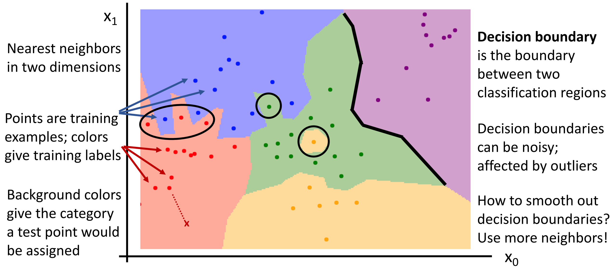

# Image Classificatin

## Data-driven approach

* 图像分类的问题：存在 semantic gap，计算机没有那种直觉，只能看到像素（数字）。

    - fine-grained categories，例如不同类的猫。
    - background clutter，背景可能和物体有聚合在一起。
    - illumination changes，例如同类物体在不同亮度下。
    - Occlusion，要识别的东西看你无法看不见全貌。

* Machine Learning: **Data-Driven Approach**
    - Collect a dataset of images and labels
    - Use ML to train a classifier
    - Evaluate the classifier on new images
    - 不是用 human knowledge，而是 data-driven. 通常我们的模型会有 2 个 API:
        - train 返回某些统计模型。
        - predict 利用模型预测新图像。
* Image Classification Datasets
    - **MNIST**
        - 10 classes(0 to 9)
        - 28*28 grayscale image
        - 50k training images, 10k test images
        
        Results from MNIST often do not hold on more complex datasets.  
        MNIST 数据集比较简单，在这个数据集上表现很好并不足以说明这个模型足够好。
        
    - **CIFAR-10**
        - 10 classes
        - 50k training images(5k per class)
        - 10k testing images(1k per class)
        
        这个数据集比较 challenging，因为很难识别。
        
    - **ImageNet**
        - ~1.3M training images (~1.3K per class)
        - 50K validation images (50 per class)
        - 100K test images (100 per class)
        - test labels are secret!
        - performance metric: Top 5 accuracy Algorithm predicts 5 labels for each image; one of them needs to be right.
        
            预测前五个只要有一个对了，就认为预测成功。 
        
        是图像分类的 gold standard. 

    - **MIT Places**
        - ~8M training images
        - 18.25K val images (50 per class)
        - 328.5K test images (900 per class)
    - **Omniglot**
        - 1623 categories: characters
        - from 50 different alphabets
        - 20 images per category
        - Meant to test *few shot learning*

如何用更大的数据集来提高我们算法 robust 分类的能力。

## First classifier: Nearest Neighbor

- **Idea**: Memorize all data and labels. Predict the label of the most similar training image.  
记住所有数据和标签。预测时进行比较，找到最相似的图像，返回其标签。
- **Distance Metric** 
    - L1 distance $d_1(I_1-I_2)=\sum_p|I_1^p - I_2^p|$
- **Performance**
    - training: $O(1)$
    - testing: $O(N)$ this is bad! *we can afford slow training, but need fast testing*.
    
        实际上有算法计算近似的最近邻。

??? Example "Problem"
    最近的邻居往往是视觉上比较类似的图像，但是这种方法在实际中并不总是有效的。
        
    
        { width="300"}
        

### Nearest Neighbor Decision Boundaries
    

    

{ width="400"}

* **决策边界**是两个分类区域的边界（can be noisy, affetecd by outliers）
* 为了平滑这些决策，我们采用 **KNN** 的方式。即选前 k 近邻，进行多数投票。

    ??? Example
        
    
        { width="450"}
        

        白色区域无法决定出结果（有 3 种不同颜色的点），需要其他启发式的方法。

* **Distance Metric**   
    不同的距离度量，决策边界有不同的性质。
    
    - L1 Manhattan
    - L2 Euclidean $d_2(I_1, I_2)=\sqrt{\sum\limits_p (I_1^p - I_2^p)^2}$

    如果距离度量选择正确，我们可以把 KNN 引用在任何类型的数据上。（虽然简单，但 robust）

## Hyperparameters

* **超参数**：我们需要在学习中做出的选择，不一定能从数据中学习，而是直接设置。
    - What is the best value of K to use?
    - What is the best distance metric to use?

    **Very problem-dependent. In general need to try them all and see what works best for our data / task.**
* **Idea**:
    - Choose hyperparameters that work best on the data (training set)
        
        BAD: K=1 总是在数据集上最好的。（因为数据总是能找到相同的）
        
    - Split data into **train and test**, choose hyperparameters that work best on test data.
        
        BAD: 不知道算法会在新的数据上的表现（被测试集污染）
        
    - Split data into **train, val, and test**; choose hyperparameters on val and evaluate on test.
        
        只有在测试的时候才接触你的测试集。
        
    - **Cross-Validation**: Split data into folds, try each fold as validation and average the results.
        
        交叉验证，将数据分为不同块。 
        
        例如下面，我们可以用 1234 来训练，5 来验证；1235 来训练，4 来验证。etc.

        !!! Example
            
    
            
            { width="450"}
            

        
            你可以为每个 fold 找到一个超参数的设置，然后平均得到结果。
        
        但是成本昂贵，在小的数据集是可以的，*but not used too frequently in deep learning*.
        
        ??? Example "交叉验证的结果"
            
    
            { width="400"}
            

    
## More about K-Nearest Neighbor

* KNN 可以实现一个有趣的功能：**Universal Approximation**.
    * As the number of training samples goes to infinity, nearest neighbor can represent any(*) function!

        可以近似于任何函数。

        ??? Example "KNN 近似"
            
    
            { width="450"}
            

* Problem: **Curse of Dimensionality**

    维数灾难。

    For uniform coverage of space, number of training points needed grows exponentially with dimension.  
    为了让训练集覆盖整个空间，我们需要的数据集呈指数级增炸。
    
    !!! Example
        假设 1 维的时候有 4 个点，2 维就需要 4^2，3 维需要 4^3 个点才能实现相同的覆盖密度。  

        对于 CIFAR-10 的图像，我们要覆盖空间（32*32 维的），需要  $2^{32\times32}\approx  10^{308}$ 个图像。

        我们无法收集足够的数据。

* KNN 在实际中很少用于像素。
    - 预测慢。
    - 无法获得足够的数据。
    - 原始像素值的距离度量在语义上意义不大。
    * But Nearest Neighbor with ConvNet features works well!    

        不是用原始像素，而是神经网络提取出的特征向量。

## Summary

!!! Summary
    - In Image classification we start with a training set of images and labels, and must predict labels on the test set
    - Image classification is challenging due to the semantic gap: we need invariance to occlusion, deformation, lighting, intraclass variation, etc
    - Image classification is a building block for other vision tasks
    - The K-Nearest Neighbors classifier predicts labels based on nearest training examples
    - Distance metric and K are hyperparameters
    - Choose hyperparameters using the validation set; only run on the test set once at the very end!