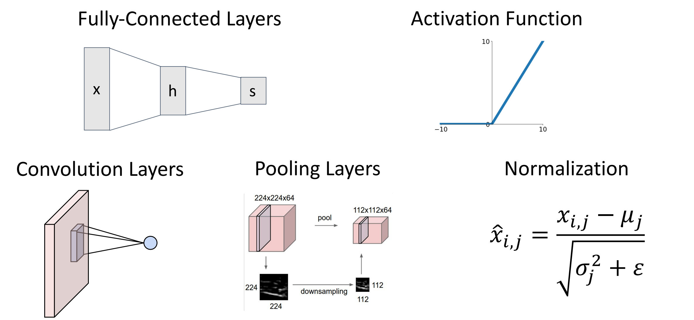

# Convolutional Networks

* **Problem**: So far our classifiers don’t respect the spatial structure of images!

    线性归类器、全连接神经网络把输入展开为一维向量可能会破坏空间结构（比如图像）。

* **Solution**: Define new computational nodes that operate on images!

    构造新的运算符。

* Components of a Convolutional Network
        
  
        { width="400"}
        

    下一排的三个操作：卷积层、池化层、归一化层（本节只讨论前向传递）

## Convolution layers

- **Fully-Connected Layer**
        
  
        { width="400"}
        

    
- **Convolution Layer**

    假设输入是三维的张量，其中 3 is channel (***e.g.*** R G B), 32*32 是高和宽。那么权重矩阵也应该是某种三维的空间结构，有时也称为过滤器。
    
    Convolve the filter with the image **i.e.** “*slide over the image spatially, computing dot products*”.

    * Filters always extend the full depth of the input volume.（？）
    
        !!! Example
            
  

            { width="450"}
            

    * the result of taking a dot product between the filter and a small 3x5x5 chunk of the image. (**i.e.** 3\*5\*5 = 75-dimensional dot product + bias)
    * 实际上卷积层总是有一组过滤器，输入图像与不同权重的滤波器进行卷积。

        得到若干个输出平面（也称为 **activation maps 激活图**，每个激活图表示的是输入图像对一个过滤器的响应程度）

        ??? Example
            
  

            { width="450"}
            

        
            我们可以把 6 个滤波器堆叠，形成一个 4 维的滤波器。（6\*3\*5\*5）这里 6 是滤波器的数量，3 是输入图像的通道数，5\*5 是滤波器的大小。
    
    * 每一个滤波器都有自己的 **bias（标量）**。滤波器与区域做完点积后，再加上 bias。
    * 考虑卷积层输出的另一种方法：得到了 28*28 的 grid，每个位置都是一个 6 维的特征向量
    * 卷积通常在**批量图像**上执行：对一批 3 维图像。
        * batch of images: $N\times C_{in} \times H \times W$
        * filters: $C_{out}\times C_{in} \times K_w\times K_h$
        * batch of outputs $N\times C_{out}\times H^’ \times W^’$

        
  

        { width="450"}
        

    

### Stacking Convolutions

??? Example 
    这里我们用 cifar-10 数据集，其中第一层卷积层有 6 个滤波器，每个是 3\*5\*5 的，3 通道。第二层有 10 个滤波器，每个的深度为 6，窗口大小 3\*3。
    
  
    { width="450"}
    

* bad thing: What happens if we stack two convolution layers? We get another convolution!

    卷积本质也是线性运算，因此卷积堆叠实际上是另一个卷积，表示能力没有增加。

* 解决方案类似：我们在卷积操作之间添加激活函数 (figure)
    
 
     
    { width="450"}
    

    * 第一层卷积神经网络的原理，如何解释？
        * Linear classifier: One template per class
        * MLP: Bank of *whole-image* templates
        * First-layer conv filters: **local** image templates (Often learns oriented edges, opposing colors)

            卷积神经网络学习到更小的局部模板（不是图像完整大小的）example 如 oriented edge color.

            ??? Example "AlexNet"
                
 

                { width="350"}
                

                
                在输入图像的每个位置提供了 64 维特征，特征向量的元素对应于输入的相应块和第一层中学习的每个模板的匹配程度。

### A closer look at spatial dimensions

!!! Example
    这里我们隐藏 c channel，只考虑 h w 两个维度。例子如下：
    
 
     
    { width="450"}
    

* 这意味着每次卷积操作，特征图会收缩，这可能限制我们卷积层的深度（层数有上限，否则到最后就消失了）
* 解决方法：**padding**

    如上图，我们在在周围填充（zero padding）使得输出和输入的大小一致。
    
    * padding is simple and work quite well.
    * **Very common**: Set $P = (K – 1) / 2$ to make output have same size as input!（Output $W – K + 1 + 2P$）  
    * **same padding**: 输入和输出一致，空间大小不会改变。
* 卷积网络的参数：滤波器大小、滤波器数量、填充量。

### Receptive Fields

* 另一种考虑卷积正在做什么：**Receptive Fields 感受野**。
* 定义: For convolution with kernel size $K$, each element in the output depends on a $K \times K$ receptive field in the input.

    每个空间位置的输出图像取决于输入图像的局部区域，比如这里只取决于 3\*3 ，这称为它的感受野。
    
 
     
    { width="350"}
    

* **Problem**: For large images we need many layers for each output to “see” the whole image image.
    * Each successive convolution adds K – 1 to the receptive field size With L layers the receptive field size is 1 + L * (K – 1).

        堆叠卷积层时，输入中的有效感受野会随着我们添加卷积层的数量线性增长。

        比如经过 2 个 3*3 卷积核之后，每个值的输出取决于原始图像 5*5 的区域。

        ??? Example "Problem: Large images"
            
 
     
            { width="400"}
            

    * 假设我们要处理高分辨率的图片（e.g. 1024*1024），为了输出能够看到输入区域里的较大区域，我们需要堆叠非常大量的卷积层。
* **Solution**: **Downsample** inside the network

#### Strided Convolution

* 带步长的卷积，是下采样的一种方式，可以更快的建立感受野。

    当步长为 1 时，滤波器每次移动一个像素。当步长为 2 时（或罕见的 3 或更多，但在实际操作中很少见），滤波器在滑动时每次跳动 2 个像素。这将产生较小的空间输出量。

    ??? Example "Strided Convolution"
        
 
     
        { width="400"}
        

    ??? Example "卷积输出大小计算"
        * Input: $3\times 32 \times 32$
        * 10 filters of size $5\times 5\$, stride 1, pad 2
        * Output size? Number of learnable parameters? Number of multiply-add operations?

        ??? Answer 
            * Output: $10\times 32 \times 32$
            * Number of learnable parameters: $10\times (3\times 5\times 5 + 1)=760$

                注意每个滤波器有一个权重矩阵和一个偏置项。

            * Number of multiply-add operations: $10\times 32\times 32=10240$ outputs, each output is the inner product of two $3\times 5\times 5=75$, so total is $75*10240=768K$

!!! Info "1*1 convolution"
    * Stacking 1x1 conv layers gives MLP operating on each input position.
    
 

    { width="350"}
    

    
    1*1 卷积的操作与 MLP 类似，但是含义有所区别：
    
    * 1\*1 卷积代表改变我们三维张量中的**通道维度数量**，全连接层意思是将张量展开为一个然后生成一个向量输出。
    * MLP 用于你想要破坏输入中的空间结构的情况（如生成类别分数的时候）

### Other types of convolution

* So far: 2D Convolution 
* 还可以有 1D、3D 卷积。其中 1D 常用于以序列出现的文本数据、音频数据。

    ??? Example "1D and 3D Convolution" 
        下图左为 1D，右为 3D。
        
 

        { width="350"}
        

        

### Summary 

!!! Summary     
    

## Pooling Layers

* **Pooling Layers**: Another way to **downsample**

    池化层也是神经网络内部下采样的方法，**不涉及任何参数的学习**。

    !!! Example
        
 

        { width="350"}
        

* Hyperparameters:
    - Kernel Size
    - Stride
    - Pooling function
        
        在给定大小的局部感受野上执行池化函数，讲这些输入值折叠成一个输出值。

* **Max Pooling**

    !!! Example "Max Pooling"
        
 

        { width="350"}
        

    * 顾名思义，最大池化是取局部区域的最大值。
    * 当 stride 和 kernel size 相等时，我们的池化区域不会有重叠。
    * 我们更喜欢池化，而不是带步长的卷积操作：因为池化不涉及任何学习的参数；带来了少量的**平移不变性**（即使图像中某些内容的确切位置发生了一点变化，最大值可能也不会变化）

* 另一个常见的池化方法：**Average Pooling**

### Summary

!!! Summary     
    

## Convolutional Networks

Classic architecture: [Conv, ReLU, Pool] x N, flatten, [FC, ReLU] x N, FC

!!! Example "LeNet-5"
    
 

    { width="350"}
    

    
 

    { width="300"}
    

    * 输入图像为灰度，只有一个输入频道。
    * 首先做 20 个卷积滤波器，same padding，ReLU，MaxPool，50 个滤波器，ReLU，Flatten 展开为单个向量，做 ReLU，最后 MLP 得到分数。
    * 实际上最大池化也引入了非线性，为什么还需要 ReLU？实际上不需要，比如当年的这篇论文就没有使用 ReLU。但在更现代的网络中，即使你有池化，通常也会加上非线性函数。

As we go through the network:

- Spatial size decreases(using pooling or strided conv)
    
    通过池化层或者步长来降低尺寸。
    
- Number of channels increases (total “volume” is preserved!)
    
    channel depth 会增加，即我们滤波器的数量。意味着空间尺寸减小的时候深度在增加，我们总体积有时被精确的保留下来。
    
- Some modern architectures break this trend -- stay tuned!
- **Problem**: Deep Networks very hard to train!

## Batch Normalization

- 问题：网络不容易收敛。在训练过程中，由于每一层的参数在同步训练，后面层的输入分布会随着前面层的变化而变化，这可能不利于优化。
- **Idea**: **“Normalize”** the outputs of a layer so they have zero mean and unit variance.

    添加归一化层，让深度网络更容易收敛。接收前一层输出，以某种方式对其进行归一化，使其均值为 0，方差为 1.

    * Why? Helps reduce “**internal covariate shif**t”, improves optimization
        
        因此我们希望标准化所有层，这样下一层可以看到来自训练过程中更平稳的输入。

* We can normalize a batch of activations like this: 

    $$
    \hat x^{(k)}=\dfrac{x^{(k)} - E[x^{(k)}]}{\sqrt{Var[x^{(k)}]}} 
    $$

    This is a **differentiable** function, so we can use it as an operator in our networks and backprop through it!

    可以把他作为计算图的一个节点，因此我们归一化就相当于在网络里插入一个层。

    
 

    { width="400"}
    

* **Problem**: What if zero-mean, unit variance is too hard of a constraint?

    强制所有层满足这个刚性约束可能太严格，我们会添加可学习的参数缩放、平移参数 $\gamma, \beta\in D$

    $$
    y_{i,j}=\gamma_j\hat{x_{i,j}}+\beta_j
    $$

    如果 $\gamma=\sigma, \beta=\mu$ 那么就恢复了本来的值。（相当于归一化层实现了 identity 函数的功能）

* **Problem**: Estimates depend on minibatch; can’t do this at test-time!

    因为我们是基于 batch 的归一化，那么测试的先后顺序会有影响。后出现的样本使用的 $\mu_j, \sigma_j$ 与之前使用的不同。

* 我们希望让模型独立于批次中的元素。因此测试的时候，**均值和方差使用训练时的平均值**（常数）。
* During testing batch norm becomes a **linear operator**! Can be fused with the previous fully-connected or conv layer.

    测试的时候可以把归一层融合进之前的线性运算符，

    !!! Example "Batch Normalization for ConvNets"
        
 

        { width="150"}
        

    Usually inserted **after Fully Connected or Convolutional layers**, and **before nonlinearity**.

- **Good**
    - Makes deep networks much easier to train!
    - Allows higher learning rates, faster convergence
    - Networks become more robust to initialization
    - Acts as regularization during training
    - Zero overhead at test-time: can be fused with conv!
- **Bad**
    - Not well-understood theoretically (yet)
    - Behaves differently during training and testing: this is a very common source of bugs!
    
### Other Normalization

* **Idea**: 不再取决于批次中所有其他元素的其他数量。我们可以使用其他的归一化方法。
* **Layer Normalization** for fullyconnected networks
    * **Same behavior at train and test!** Used in RNNs, Transformers.
    
 

    { width="400"}
    

* **Instance Normalization**
    
 

    { width="400"}
    

!!! Info "Comparison of Normalization Layers"
    BatchNorm 是对一个 batch-size 样本内的**每个特征**分别做归一化，LayerNorm 是分别对**每个样本**的所有特征做归一化。
    
 

    { width="450"}
    

卷积层：Most computationally expensive!

<!-- **Problem**: What is the right way to combine all these components? -->